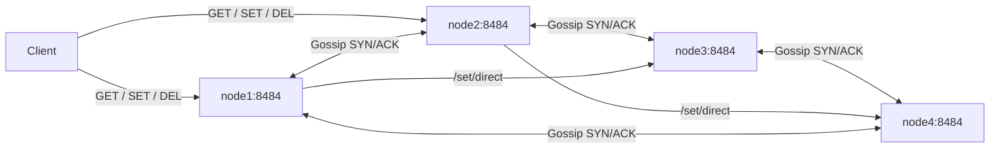
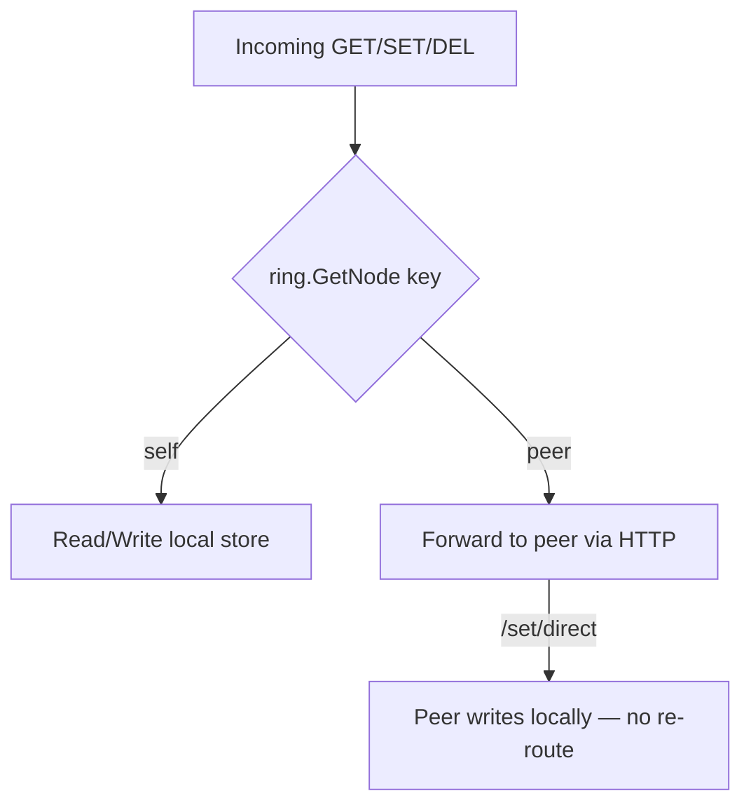

<div align="center">
  <picture>
    
  </picture>
</div>
<br>

## LimeDB

[](https://deepwiki.com/namanvashistha/limedb)

A distributed key-value store built in Go. Any node accepts reads and writes — requests are routed to the correct owner via consistent hashing.

---

## Architecture



**Request routing:**



---

## How It Works

### Consistent Hashing — `internal/ring/ring.go`
- xxhash-based ring with `VIRTUAL_NODES` slots per physical node (default 256)
- `VIRTUAL_NODES=0` → 1 real slot per node (pure consistent hashing)
- `AddNode` / `RemoveNode` are idempotent and thread-safe

### Gossip — `internal/gossiper/gossiper.go`
- SYN/ACK epidemic protocol; fires every 30s
- Each SYN carries a digest of `{nodeUrl, heartbeat}` for all known peers
- On receiving a SYN, if a digest contains an unknown node URL → `ring.AddNode(url)` immediately
- Peers marked stale after missing heartbeats; dead peers tracked separately

### Store Backends — `internal/store/`
| Backend | File | Behavior |
|---|---|---|
| `LSM` (active) | `lsm/` | LSM-tree engine: binary WAL (CRC-protected) → MemTable → SSTables with Bloom filters, size-tiered compaction |
| `Memory` | `memory.go` | In-memory map, lost on restart |
| `FileSystem` | `fsstore.go` | JSON file per node, strict disk read/write on every op, atomic rename on write |

Every record carries a **last-write-wins (LWW) timestamp** assigned once by the
coordinator that accepted the write. The timestamp travels through the WAL,
SSTables, and replication messages, so replicas converge deterministically:
higher timestamp wins; on an exact tie a tombstone beats a value. Deletes are
replicated tombstones — an older value can never resurrect a deleted key.
LWW uses wall clocks, so heavy clock skew between nodes can reorder
conflicting writes (same tradeoff Cassandra makes).

Active backend is injected at startup in `cmd/server/main.go`.

---

## Project Structure

```
limedb/
├── cmd/server/main.go          # startup, DI wiring
├── internal/
│   ├── config/config.go        # env + flag config
│   ├── gossiper/gossiper.go    # epidemic gossip protocol
│   ├── node/service.go         # routing logic (HandleGet/Set/Del)
│   ├── ring/ring.go            # consistent hash ring (xxhash)
│   ├── server/server.go        # fasthttp handlers + router
│   └── store/
│       ├── backend.go          # Backend interface
│       ├── memory.go           # in-memory store
│       ├── fsstore.go          # filesystem JSON store
│       └── xyz.go              # sample backend
├── web/                        # Next.js dashboard
├── tui/                        # Python TUI client
├── docker-compose.yml          # production 4-node cluster
└── docker-compose.dev.yml      # dev with hot-reload + data bind mount
```

---

## Quick Start

### Docker (recommended)
```bash
# Dev cluster — 4 nodes, hot-reload Go + Next.js, data persisted to ./data/
make dev

# Production cluster
docker compose up -d
```

### Local cluster
```bash
go build -o build/limedb ./cmd/server/main.go

NUM_NODES=4 ./run_go_cluster.sh
```

---

## API

All endpoints exposed by every node on port `8484` (configurable).

| Method | Path | Body / Params | Description |
|---|---|---|---|
| `POST` | `/api/v1/set` | `{"key":"k","value":"v"}` | Write — routed to ring owner |
| `GET` | `/api/v1/get/{key}` | — | Read — routed to ring owner |
| `DELETE` | `/api/v1/del/{key}` | — | Delete — routed to ring owner |
| `POST` | `/api/v1/set/direct` | `{"key":"k","value":"v"}` | Internal — write locally, no re-route |
| `GET` | `/api/v1/keys` | `?page=1&pageSize=20` | List this node's local keys |
| `GET` | `/api/v1/cluster/state` | — | Node URL, peers, status |
| `GET` | `/api/v1/cluster/ring` | — | Ring stats + hash ranges |
| `GET` | `/api/v1/cluster/gossip` | — | Gossip metrics + peer heartbeats |
| `GET` | `/api/v1/health` | — | Health check |
| `POST` | `/gossip` | messenger.Message | Internal gossip SYN/ACK |

---

## Configuration

| Env / Flag | Default | Description |
|---|---|---|
| `SERVER_PORT` / `-server.port` | `8484` | HTTP listen port |
| `NODE_URL` / `-node.url` | `http://localhost:<port>` | This node's public URL |
| `NODE_PEERS` / `-node.peers` | — | Comma-separated bootstrap peer URLs |
| `VIRTUAL_NODES` / `-node.routing.virtual-nodes` | `256` | Virtual nodes per physical node |
| `DATA_DIR` / `-data.dir` | `~/.limedb` | Directory for filesystem store JSON files |
| `OTEL_ENDPOINT` / `-otel.endpoint` | `localhost:4317` | OpenTelemetry collector (empty = disabled) |

---

## Persistent Data (LSM store)

Each node writes to `DATA_DIR/<NODE_URL>_lsm/` — a WAL (`wal.log`), SSTables
(`*.sst`), and Bloom filter sidecars (`*.bloom`).

> **Upgrade note:** the WAL and SSTable formats changed when LWW timestamps
> were introduced (binary WAL `LIMEWAL2`, SSTable footer v2). Data dirs
> written by older versions are rejected at startup with a clear error —
> wipe `DATA_DIR` and restart.

---

## Web Dashboard

```bash
# dev: auto-starts with make dev at http://localhost:3000
# standalone:
cd web && npm run dev
```

Features: node switcher, all-nodes fan-out, structured GET/SET/DEL query executor, inline seed data generator (faker.js).

---

## Cluster Membership

All peers listed in `NODE_PEERS` at startup form the **initial cluster** and
auto-join the routing ring — list the full initial member set on every node
(see `docker-compose.yml` / `run_go_cluster.sh`). Nodes added later are
discovered via gossip but stay out of routing until an operator runs the
admin activate → bootstrap → promote flow (`/api/v1/admin/membership/activate`
etc.).

---

## Known Limitations

- **No key migration yet** on ring change: bootstrap data streaming is planned; today a promoted node starts empty for its ranges
- **Reads are consistency ONE**: first replica that answers wins; read repair and QUORUM reads are planned
- **No hinted handoff**: a replica that misses a write catches up only when the key is written again with a newer timestamp
- **Gossip adds nodes only**: dead nodes are not automatically removed from the ring
- **LWW wall-clock timestamps**: conflicting writes within clock-skew windows resolve by timestamp, not causality

---

## Tech Stack

| | |
|---|---|
| Language | Go 1.21+ |
| HTTP | fasthttp |
| Hash | xxhash |
| Observability | OpenTelemetry (traces + metrics) |
| Frontend | Next.js 16, Tailwind, shadcn/ui |
| Dev tooling | air (hot-reload), Docker Compose |

---

## Inspiration

- Cassandra — gossip protocol, consistent hashing
- Chord DHT — ring routing model
- Redis — simple key-value API

---

## License

Apache 2.0 — see [LICENSE](LICENSE).
